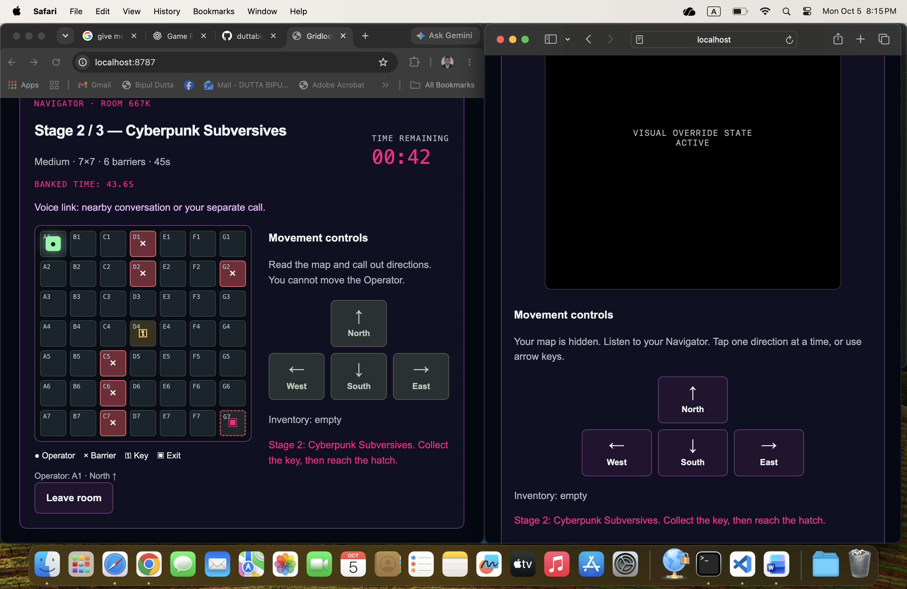

# Gridlock Syndicate — Three-stage campaign

Raw HTML, CSS Grid and vanilla JavaScript. This package upgrades the frontend AND
the authoritative Cloudflare Worker. Do not replace only the two browser files.

## Replace and run
Back up your existing project. Replace public/index.html, public/lobby.js and
worker.mjs. Keep the same wrangler.jsonc, Worker name, ROOMS binding and v1 migration.
The included configuration is unchanged; no extra database credentials are needed.

    npx wrangler dev

Open the local URL in two separate browsers. Reload both after file replacement.
A legacy Phase III room resets to the lobby on its first campaign request while
preserving its two seats. Do not upgrade during an important active match.

To publish after local testing:

    npx wrangler deploy

## Campaign
1. Green Terminal: 5×5, 3 barriers, 60 seconds.
2. Cyberpunk Subversives: 7×7, 6 barriers, 45 seconds.
3. Meltdown Threat: 9×9, 12 barriers, 30 seconds.

Server creates a randomized map with a guaranteed route at every stage.
Collect that stage's key before entering its hatch. Stage clearance immediately
starts the next timer, resets position/key/sequence and assigns a new match ID.
No final victory appears until stage 3. Stage themes change on both screens.
Navigator gets map/coordinates; Operator gets neither, at every stage.
Server rejects stale stage actions, duplicate movement and unauthorized controls.
Timeout fails the entire campaign; Navigator returns both seats to the lobby.

Score is the sum of exact server-calculated remaining seconds at all three exits,
displayed to one decimal place. Gold: >60; Silver: >30; Bronze: completed campaign.
Exactly 60 is Silver; exactly 30 is Bronze. Failed campaigns never enter the board.

## Global scoreboard
A separate Durable Object using the EXISTING ROOMS binding stores the top 20
successful crews for this deployment. Scores come only from server room results.
Final-stage match IDs deduplicate completion retries. Click Refresh leaderboard.
This is shared across rooms on this Worker, not across different deployments.
Both callsigns become public on completion; use nicknames. No tokens are exposed.
This is a prototype leaderboard, not a fully hardened anti-cheat service.
Leaderboard unavailability does not undo a campaign victory.

## Synchronization
Near-real-time polling: 200ms during play, 1s in the lobby. Not zero-latency.
Timer continues while disconnected; no built-in voice. Use nearby speech or a call.
API_BASE defaults to the same origin. For a separate frontend, configure API_BASE
and ALLOWED_ORIGINS as before. Never put Cloudflare account credentials in JS.

## Tests
    node --check worker.mjs
    node --check public/lobby.js
    node campaign-check.mjs

Tests use mocked Durable Object storage, not deployed Cloudflare infrastructure.
They cover all stage sizes/counts, solvability, blind projection, clocks, stale
and duplicate movement, authorization, scores, leaderboard deduplication, restart
and timeout. browser-check.cjs requires Playwright and Chromium.
Visual/browser and deployed two-device campaign testing must still be performed.

## Manual acceptance
Clear stage 1: both screens should switch to pink, stage 2, 7×7, 45s.
Clear stage 2: both switch to orange/red, stage 3, 9×9, 30s.
Clear stage 3: both show the same rating and stage score breakdown.
Refresh leaderboard: exactly one crew entry for that completion.
Restart: same room code and seats; campaign begins at stage 1 after host starts.
Test timeout and refresh recovery on each stage and the 9×9 mobile layout.

Larger grids, themes and tighter timers add progression, but do not by themselves
prove championship quality. Teamwork puzzles, playtesting and production hardening
remain separate future work. Rate limiting, load testing and WebSockets are not
included in this version.
